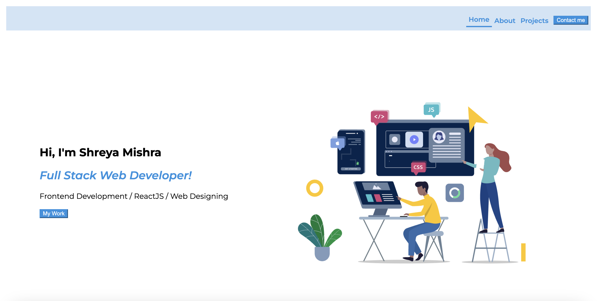

# Shreya_Mishra_React_Portfolio

This repository provides ditails of my work and education. 
GIT HUB URL:https://github.com/shreyamishra9618/shreyaportfolio

## Deployed Application Link 
The website is deployed [here](https://mattdack.github.io/hiking-app).

### Description
This Website, acts as an introduction to my coding experience, a display of my coding portfolio, and listing of contact information. The webpage utilizes semantic React to aesthetically generate a landing page, a section describing me, a section for my portfolio, and a section for contact information. Flexbox and relative positioning were used to generate the layout. The page is responsive to different screen sizes.

### Installation
#### `npm install` 
#### `npm i react-router-dom` 
#### `npm i react-icons`
#### `npm install --save lottie-reat`

### Usage
Select the links in the header navigation bar to move to main sections on the webpage. Select the photos for each portfolio item to get taken to the Github repository for each project.

## Available Scripts

In the project directory, you can run:

### `npm start`

Runs the app in the development mode.\
Open [http://localhost:3000](http://localhost:3000) to view it in your browser.

The page will reload when you make changes.\
You may also see any lint errors in the console.

### `npm run build`

Builds the app for production to the `build` folder.\
It correctly bundles React in production mode and optimizes the build for the best performance.

The build is minified and the filenames include the hashes.\
Your app is ready to be deployed!

See the section about [deployment](https://facebook.github.io/create-react-app/docs/deployment) for more information.

## Credits & Collaborations
The site is created by Shreya Mishra.
 
You can find my other projects here:  [Shreya](https://github.com/shreyamishra9618)

